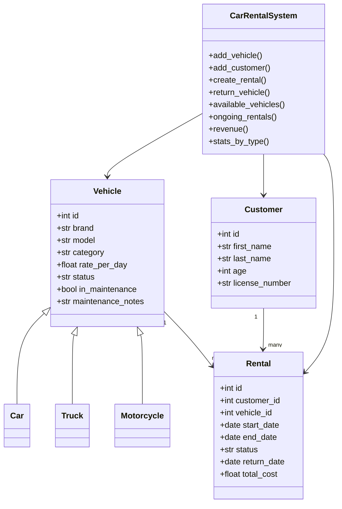

```mermaid
classDiagram
    class Vehicle {
        +int id
        +str brand
        +str model
        +str category
        +float rate_per_day
        +str status
        +bool in_maintenance
        +str maintenance_notes
    }

    class Car
    class Truck
    class Motorcycle

    class Customer {
        +int id
        +str first_name
        +str last_name
        +int age
        +str license_number
    }

    class Rental {
        +int id
        +int customer_id
        +int vehicle_id
        +date start_date
        +date end_date
        +str status
        +date return_date
        +float total_cost
    }

    class CarRentalSystem {
        +add_vehicle()
        +add_customer()
        +create_rental()
        +return_vehicle()
        +available_vehicles()
        +ongoing_rentals()
        +revenue()
        +stats_by_type()
    }

    Vehicle <|-- Car
    Vehicle <|-- Truck
    Vehicle <|-- Motorcycle
    Customer "1" --> "many" Rental
    Vehicle "1" --> "many" Rental
    CarRentalSystem --> Vehicle
    CarRentalSystem --> Customer
    CarRentalSystem --> Rental
```
